================================================================
How to contribute to DreamHost Cloud Documentation using Windows
================================================================

.. csv-table::
    :header: "Table of Contents"

    `Introduction <#introduction>`_
    `Reporting issues <#reporting-issues>`_
    `DreamHost cloud documentation basics <#dreamhost-cloud-documentation-basics>`_
    `Required tools <#required-tools>`_
    `Fork and clone the Repository <#fork-and-clone-the-repository>`_
    `Making your change or contribution <#making-your-change-or-contribution>`_
    `Testing your change with tox <#testing-your-change-with-tox>`_
    `Commit your change <#commit-your-change>`_
    `Submit a pull request <#submit-a-pull-request>`_
    `Cleaning up <#cleaning-up>`_

Introduction
~~~~~~~~~~~~

The DreamHost Cloud documentation is published on the
`DreamHost Knowledge Base <https://help.dreamhost.com/hc/en-us>`_, while the
source documents are stored on GitHub.  If you notice something needing
correction, or you wish to contribute an awesome cloud-related article to the
knowledge base, this guide can be used to report or correct the issue yourself,
on GitHub.

This guide assumes that the contributor is using a Windows 7 or Windows 10
system, however much of the contents will work on other operating systems
with minor modifications.

Reporting Issues
~~~~~~~~~~~~~~~~

If you only wish to notify us of an issue you found, you can do so by creating
an issue on the `GitHub Issues <https://github.com/dreamhost/dreamcloud-docs/issues>`_ page.
Our team will be notified of the issue and will fix it for you.
Alternatively, you can submit a ticket via the DreamHot `Support panel page <https://panel.dreamhost.com/index.cgi?tree=support.msg&>`_
about the needed correction.

DreamHost Cloud Documentation Basics
~~~~~~~~~~~~~~~~~~~~~~~~~~~~~~~~~~~~

The DreamHost Cloud documentation is stored on GitHub in the `dreamcloud-docs <https://github.com/dreamhost/dreamcloud-docs>`_
repository with each article being stored in `RST <http://docutils.sourceforge.net/rst.html>`_
(reStructuredText) format.  For RST examples and our style guideline, please
check out `styleguide.rst <https://github.com/dreamhost/dreamcloud-docs/blob/master/styleguide.rst>`_.

From the RST files, the contents are processed and published to the DreamHost
Knowledge Base automatically after each change to the repository.

Required Tools
~~~~~~~~~~~~~~

The tools required include a git client to clone, commit and do pull requests
of your changes, and tox to verify the formatting of the changes made.  There
are multiple programs and methods to perform these tasks, but the easiest ones
for Windows are the GitHub Desktop for git and Cygwin for tox.

Cygwin
------

The Cygwin software suite contains a large number of Linux packages, compiled
to run in their own environment in Windows.  We will use a rather basic setup
with the only addition being the Python interpreter.

Download the Cygwin install program from the `Cygwin <https://cygwin.com/install.html>`_ website.

Run the program to install it.  During the setup, select to "Install from
Internet".  The remaining default settings are fine as you install.  Select
a download site that sounds like it may be close to you, otherwise the
mirrors.kernel.org selection is a good default.

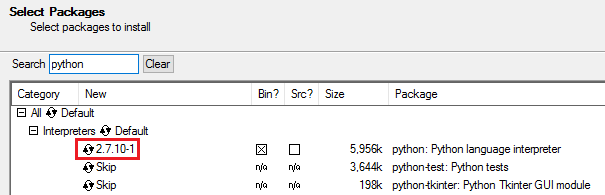

Select the packages to install. The default packages are sufficient however
Python needs to be added. In the search box type "python". Next, under
"Interpreters" find "python" and click on "Skip" to have it change to a version
like shown above.

Continue the rest of the install selecting the defaults.

.. note::

    This installation often fails the first time you attempt to complete the
    install. In some cases, you must progress through the steps several times.
    Just keep attempting to install. Eventually it will complete.

Our cygwin install needs python "pip", which isn't available in a package.
Download the `get-pip.py <https://bootstrap.pypa.io/get-pip.py>`_ file by
right-clicking and saving the file to your downloads directory.  In Windows,
just right click and choose "Save link as...".

Open the "Cygwin64 Terminal" application. Next, use python to install pip by
running get-pip.py file. In the example below, make sure to replace USERNAME
with your Windows user name.

.. code:: bash

    $ python /cygdrive/c/Users/USERNAME/Downloads/get-pip.py

It should show some progress bars and then complete the install on its own.

You can now install tox, the tool we did all the previous steps to obtain:

.. code:: bash

    $ pip install tox

You now have a working tox install to use with our repository!

GitHub Desktop
--------------

The GitHub desktop software provides a GUI for handling the git client and some
nice features like easy comparing of files, one-click commits, and pull
requests.  This software can be downloaded at `https://desktop.github.com/ <https://desktop.github.com/>`_
for both Windows and Mac systems.

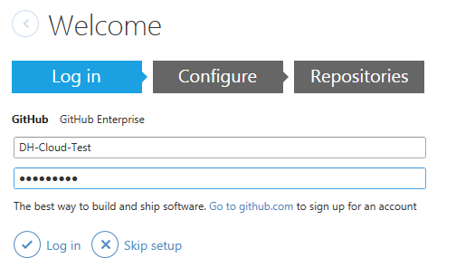

After installation, you are asked to setup your GitHub client.  First,
enter your user and password for the GitHub website.

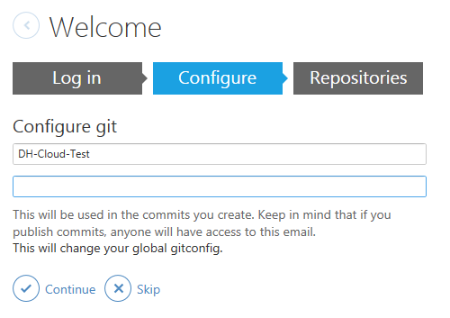

The second page wants details about your GitHub name and email address.

The last window wants repositories selected.  It is fine to skip this step.

Fork and clone the repository
~~~~~~~~~~~~~~~~~~~~~~~~~~~~~

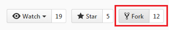

From the GitHub website, browse to the `dreamcloud-docs`_
repository and look in the top right corner for the "Fork" button.

This will make a fork of our repository in your own GitHub account.

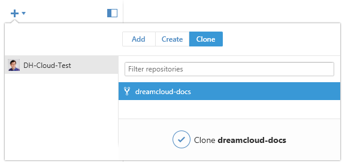

Back in the GitHub client, click the "+" button on the top left and then the
"Clone" tab. Below the 'Clone' tab, you should see your recently forked repo
called dreamcloud-docs. Click it and select the "Clone dreamcloud-docs" button
below.

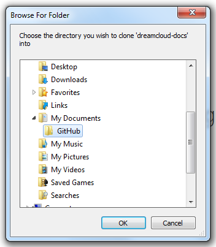

The GitHub client asks you to confirm the location of the clone. It's
recommended for simplicity to select the default of Documents and GitHub.

Making your change or contribution
~~~~~~~~~~~~~~~~~~~~~~~~~~~~~~~~~~

Now that you have the repository checked out locally on your system, you can
use any text client you prefer to make changes or create new content.  Our
system expects plaintext files, so keep this in mind when saving your file.
The best pre-installed text editors to use would be Notepad or Wordpad.

Navigate in Windows Explorer to your user\Documents\GitHub directory. In that
directory is the "dreamcloud-docs" directory where you can see the source code.
Inside the "source" directory is where the RST and image files are located,
separated into different directories for dreamobjects and dreamcompute.

Testing your change with tox
~~~~~~~~~~~~~~~~~~~~~~~~~~~~

To make sure your changes conform to the whitespace, line length and other
rules, it is best to run tox.  The process also generates HTML output
which you can view in your browser to make sure the formatting and images
are where you want them.

Open the "Cygwin64 Terminal" application.

Change to the directory which contains your git clone of the
dreamcloud-docs repository.  Using the default values, it should be in your
users directory under Documents and GitHub.  Modify this command to fit your
directory structure:

.. code:: bash

    $ cd /cygdrive/c/Users/USERNAME/Documents/GitHub/dreamcloud-docs/

Then run tox:

.. code:: bash

    $ tox

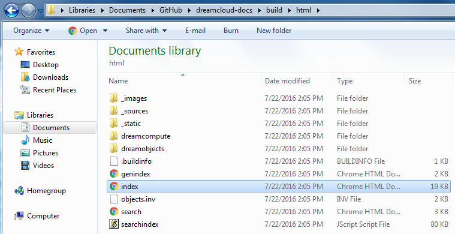

This process can take a while to complete, as it makes 8000+ files and
generates content.  If the process completes without error, you can view the
HTML output by browsing in Windows Explorer to the Documents folder, then
GitHub, dreamcloud-docs, build, html and then click on index.html.

The index page will have a link for all generated documents, so you can search
it to find the document or search in that html directory for the file you want
to verify.

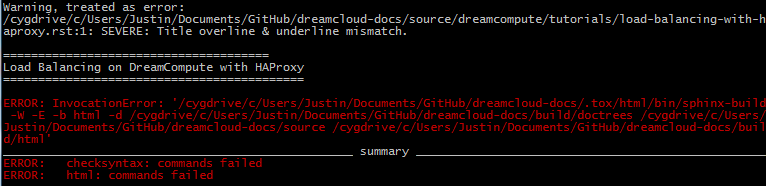

If there are errors, the output will give you details on where to look for
them.  Here is an example of a purposely broken title in a file.

The second line points to the file that has an error. The ":1:" after it
indicates the line number that has the error The reason for the error is at
the end.

The text is also displayed that contains the error. In this case the title
should have equal signs ("=") the full length of the title in the .rst file.
Fix the error and run "tox" again. Repeat until all errors are corrected.

Commit your change
~~~~~~~~~~~~~~~~~~

Open the GitHub Desktop application. Choose the repository on the left to view.
In the top center make sure the 'Changes' button is selected. You can then see
what files have been changed.  If something was inadvertently changed,
right-click it and select discard changes.  A diff of the changes appear
on the right pane of the client.  If everything looks correct, it is time to do
a commit.

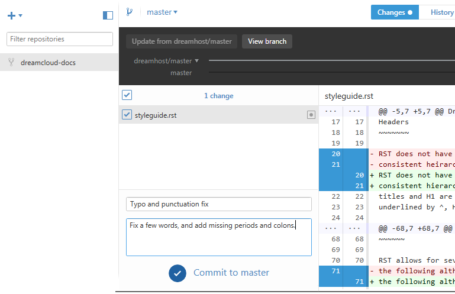

Give the commit a name, and a comment and then click the "Commit to master"
button.

Submit a pull request
~~~~~~~~~~~~~~~~~~~~~

A pull request basically tells the owners of the repo that you forked, made a
change, and are requesting to send it to their repository.  They then
have the option to review it, make changes, accept or decline it.  In this case
the owners are the DreamHost Knowledge Base team and DreamHost Cloud team.

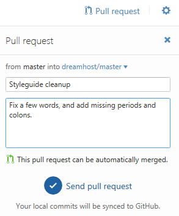

Give the pull request a name, a comment, and then click the "Send pull request"
button.

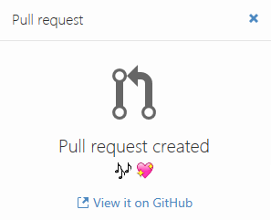

If everything submits as expected, this icon appears.

The pull request appears on the GitHub website on the `pull requests <https://github.com/dreamhost/dreamcloud-docs/pulls>`_
page. The DreamHost teams check out the commit and make comments and
suggestions as needed. If all looks well, DreamHost accepts it into the
repository. GitHub then notifies all parties involved.

Cleaning up
~~~~~~~~~~~

There shouldn't be much more to do at this point, as the dreamcloud-docs repo
is in sync with the "master".  Should the local copy get out of sync,
click the "sync" button on the top right to update the clone of any new changes
that happened in the meantime.

To make additional changes, repeat the process again starting at the
`making your change or contribution <#making-your-change-or-contribution>`_ section.

Thanks for contributing!

.. meta::
    :labels: github tox sphinx contribute documentation cloud dreamcompute dreamobjects
