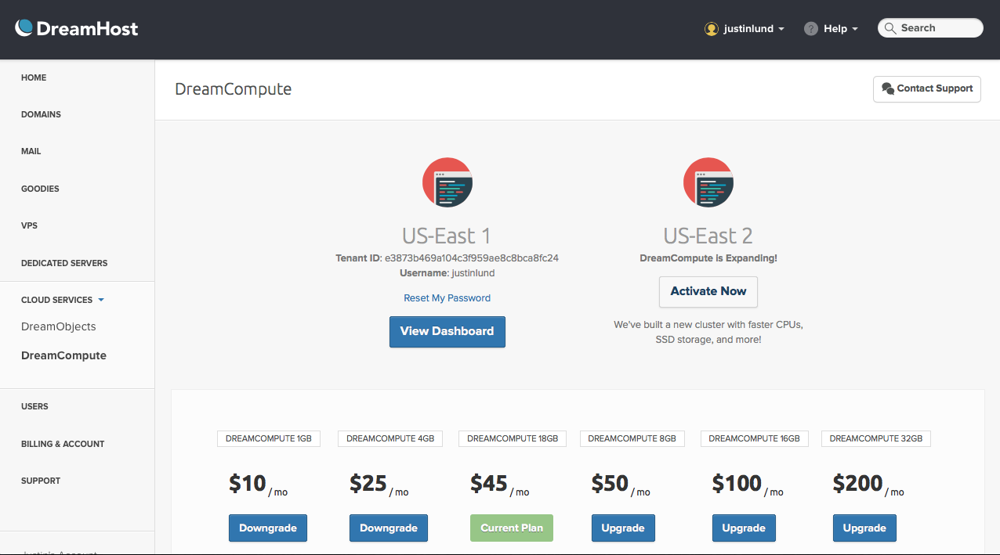
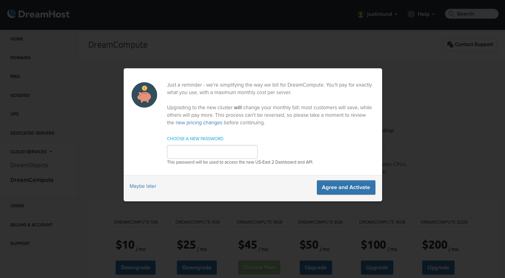

How To Activate DreamCompute zone US-East 2
===========================================

.. note:: These instructions are valid for customers of DreamCompute
          Beta. If you have joined DreamCompute after March 30 2016
          these instructions are not valid for you.

Once you're ready to switch to the new billing system and make full
use of the faster DreamCompute zone, login into `DreamHost Control
Panel`_ and click on the button **Activate now** to start the wizard.

.. note:: Adding US-East 2 as a new cluster to your DreamCompute plan
          requires also changing your billing system: please make sure to read
          `how your bill will change`_ before proceeding.

Pick a new password to access US-East 2:

Confirm activation and you're done. You can use the new password to
login into the `US-East 2 dashboard`_.

.. _how your bill will change: /articles/217442428
.. _DreamHost Control Panel: https://panel.dreamhost.com/index.cgi?tree=cloud.compute&
.. _US-East 2 dashboard: https://iad2.dreamcompute.com

.. meta::
  :labels: dreamcompute faq billing
