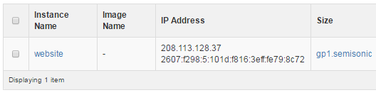

==================================================
How To Setup DNS For Your Domains For DreamCompute
==================================================

Introduction
~~~~~~~~~~~~

DNS is the technology that allows your domain to point to a specific IP address
and allow the server listening on it to host your domain.  There are several
different types of records, but the most commonly used ones will be:

* A - Used to link a domain or subdomain to an IPv4 address.
* AAAA - Used to link a domain or subdomain to an IPv6 address.
* CNAME - Used to link a domain or subdomain to another domain or subdomain.

For most purposes, you'll only need to use A and AAAA records.

Find Your Public IP Address
~~~~~~~~~~~~~~~~~~~~~~~~~~~

Each DreamCompute instance in the US-East 2 cluster is assigned a public IPv4
and IPv6 address.  To find these addresses, you can either go in the
DreamCompute dashboard to the `Instances <https://iad2.dreamcompute.com/project/instances/>`_
page to see them listed in the "IP Address" column:

or you can see them on the command line with "nova":

.. code:: bash

    $ nova list
    +--------------------------------------+---------+--------+------------+-------------+-------------------------------------------------------------+
    | ID                                   | Name    | Status | Task State | Power State | Networks                                                    |
    +--------------------------------------+---------+--------+------------+-------------+-------------------------------------------------------------+
    | 10a3b11b-dc2f-42a2-b5d8-84508a5156a5 | website | ACTIVE | -          | Running     | public=208.113.128.37, 2607:f298:5:101d:f816:3eff:fe79:8c72 |
    +--------------------------------------+---------+--------+------------+-------------+-------------------------------------------------------------+

If you have multiple instances, you will have multiple public IPv4 and IPv6
addresses and will need to track which ones host which websites or other
services.

DreamHost Control Panel
~~~~~~~~~~~~~~~~~~~~~~~

* Go to the `Manage Domains <https://panel.dreamhost.com/index.cgi?tree=domain.manage&>`_
  page in the control panel.
* If your domain is not yet listed here, click the "Add Hosting to a Domain /
  Sub-Domain" button near the top left of the page.
* Scroll down to the "DNS Only" hosting section towards the bottom, and enter
  your domain.  Click the "Host DNS only!" button.  Wait a few minutes for
  processing.
* Back on the Manage Domains page, click the "DNS" link directly under your
  domain name.

.. figure:: images/DreamCompute-dns-panel.png

* In the "Add a custom DNS record to YOURDOMAIN:" section, enter the A record
  for the domain or subdomain you wish to host, and the PTR record to be based
  on.  For example, if you want "mail.mydomain.com" then "Name" will be "mail",
  "Type" will be "A" and "Value" will be your public IPv4 address for your
  DreamCompute instance.  Click "Add Record Now!".

.. figure:: images/DreamCompute-adding-custom-dns-record.png

Repeat the last step as many times as needed to add additional A records for
domains you wish to host on your instance.

Wait For DNS Propagation
~~~~~~~~~~~~~~~~~~~~~~~~

The default TTL (time-to-live) for DreamHost name servers is 4 hours, and so
any change to your DNS records should be updated nearly everywhere around the
world in that time.  If you will be making frequent changes to DNS, you can
`contact DreamHost support <https://panel.dreamhost.com/index.cgi?tree=support.msg&>`_
to have your TTL changed to 5 minutes instead.

.. meta::
   :labels: dreamcompute dns aaaa record
