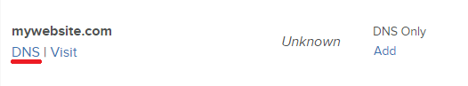
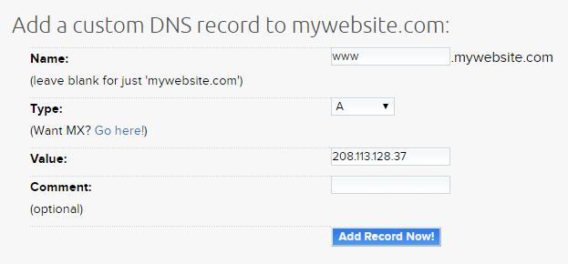

======================================================
How To Setup PTR / Reverse DNS Records on DreamCompute
======================================================

Introduction
~~~~~~~~~~~~

PTR records, also sometimes called reverse DNS lookup or rDNS, are needed for
specific server types like email servers, and other host verification purposes.

It is possible to setup PTR records for IPv4 addresses in DreamCompute, however
IPv6 rDNS is not available at this time.

Here is how you can start the process for PTR record setup.

Step 1: DreamHost Control Panel
~~~~~~~~~~~~~~~~~~~~~~~~~~~~~~~

The first step is to be completed by the customer, and happens in the DreamHost
control panel.

* Go to the `Manage Domains <https://panel.dreamhost.com/index.cgi?tree=domain.manage&>`_
  page in the control panel.
* If your domain is not yet listed here, click the "Add Hosting to a Domain /
  Sub-Domain" button near the top left of the page.
* Scroll down to the "DNS Only" hosting section towards the bottom, and enter
  your domain.  Click the "Host DNS only!" button.  Wait a few minutes for
  processing.
* Back on the Manage Domains page, click the "DNS" link directly under your
  domain name.

* In the "Add a custom DNS record to YOURDOMAIN:" section, enter the A record
  for the domain or subdomain you wish to host, and the PTR record to be based
  on.  For example, if you want "mail.example.com" then "Name" will be "mail",
  "Type" will be "A" and "Value" will be your public IPv4 address for your
  DreamCompute instance.  Click "Add Record Now!".

Repeat the last step as many times as needed to add additional A records for
domains you wish to host on your instance.  If you add multiple records, our
system may not pick the one you wanted which requires the last step below.  If
you only enter one, chances are it will pick the right one and get set on its
own after a few hours of DNS propagation time.

Step 2:  Contact Support
~~~~~~~~~~~~~~~~~~~~~~~~

Due to the possibly of multiple domains and multiple A records pointing to your
public IPv4 address, our system may not pick the one you want by default.  To
remedy this, please `contact our support team <https://panel.dreamhost.com/index.cgi?tree=support.msg&>`_
and let us know the following:

* Which domain or subdomain you want the PTR record to point to.
* The public IPv4 address.

Our support team will make sure that your public IPv4 address has the right
record set and will push out a DNS update.  After a wait of 4 or so hours for
DNS propagation, your PTR record should show up!

Step 3:  Checking PTR Records
~~~~~~~~~~~~~~~~~~~~~~~~~~~~~

Please allow at least 4 hours for DNS propagation, and after this you can check
for the proper value.  To do so from the command line:

.. code:: bash

    dig -x PUBLICIPADDRESSHERE

There are other websites that can help with this too, if you google for
"PTR lookup".

.. meta::
   :labels: ptr rdns dreamcompute ipv4 ipv6
