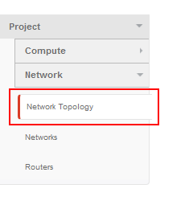
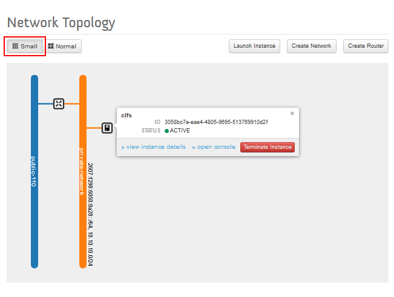
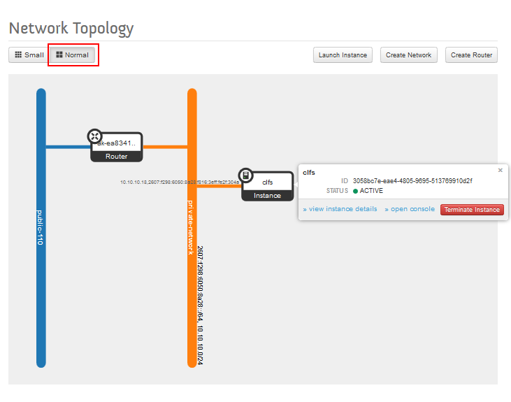
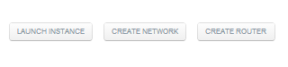

================
Network Topology
================

The dashboard page is located under the Project -> Network ->
`Network Topology <https://dashboard.dreamcompute.com/project/network_topology/>`_
page, where you can view a graphical representation of the interaction of your
routers, networks, and instances.

Viewing Network Topology
------------------------

Once you have logged into the DreamCompute dashboard, click the **Network
Topology** tab in the left-hand panel under Project -> Network.

*Two possible network topology views appear.*

Small View
----------

You can select the small view by clicking the **SMALL** button at the top
left which displays a basic view of your DreamCompute setup where:
* routers and instances are shown as small boxes,
* networks are shown as labeled vertical lines, and
* connections between networks/routers and the public internet (public-110 in
this example) are shown as horizontal lines.

Normal View
-----------

You can select the normal view by clicking the **NORMAL** button at the top
left which is similar to the small view except it shows more details,
including:
* IP addresses are shown next to the associated routers and instances, and
* larger boxes representing the routers and instances show the type and name
displayed inside.

Other Features
--------------

The Network Topology page also contains buttons on the upper right which open
other parts of the DreamCompute dashboard, including:
* Launch Instance &mdash; opens the
`**Instances** <https://dashboard.dreamcompute.com/project/instances/>`_ page,
* Create Network &mdash; opens the
`**Networks** <https://dashboard.dreamcompute.com/project/networks/>`_ page, and
* Create Router &mdash; opens the
`**Routers** <https://dashboard.dreamcompute.com/project/routers/>`_ page.

If you hover your mouse over an router or instance, you can see additional
details with additional management shortcuts.

.. meta::
    :labels: network
