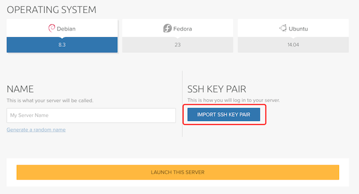
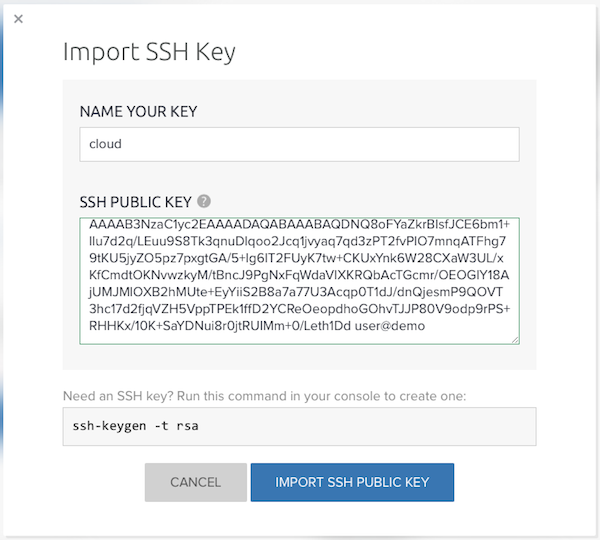

====================================================
How to upload an SSH key via the Cloud Control Panel
====================================================

DreamCompute utilizes ssh keys for accessing your servers for increased
security and simplified user management. On first boot, your public key is
injected into the server for the default user. This enables passwordless logins
and prevents unnecessary file modifications on startup.

SSH key pairs contain a private key and a public key. Hang on to your private
key and keep it secret. The public key ends with a ".pub" extension and will
be injected into your server.

Existing SSH key
~~~~~~~~~~~~~~~~

If you're using Mac or Linux, you may already have SSH keys. If so, they are
typically stored in the hidden .ssh directory.

.. code-block:: console

    [user@localhost]$ ls ~/.ssh/
    /home/myuser/.ssh/id_rsa  /home/myuser/.ssh/id_rsa.pub

If you're using Windows, there's a good chance you're using `PuTTY
<http://www.chiark.greenend.org.uk/~sgtatham/putty/>`_.
SSH keys generated on Windows systems using the generator (puttygen.exe)
are not stored in a uniform location, but instead where the user chooses
to save them.

Create a new SSH key
~~~~~~~~~~~~~~~~~~~~

Windows via PuTTYgen
--------------------

PuTTYgen is an SSH key generator program for Windows. It is included in the
PuTTY MSI installer package that can be downloaded from the `PuTTY
<http://www.chiark.greenend.org.uk/~sgtatham/putty/>`_ website.

.. figure:: images/Puttygen.png
    :alt: PuTTY

Start the program, click on the "generate" button, and follow the instructions
displayed. When complete, click the "save private key" button to
save the .ppk (PuTTY Private Key File) file for use with PuTTY later.

The text at the top labeled "Public key for pasting into OpenSSH
authorized_keys file" can be copy/pasted into a text file for importing into
the Cloud Control Panel and other future uses.

.. note:: The "save public key" button saves a modified version of the public
          key that won't directly import into the Cloud Control Panel.

Mac and Linux via ssh-keygen
----------------------------

ssh-keygen is a command line key generator tool included on Mac, Linux and
other unix-based operating systems. Run it in your terminal app.

.. code-block:: console

    [user@localhost]$ ssh-keygen
    Generating public/private rsa key pair.
    Enter file in which to save the key (/home/myuser/.ssh/id_rsa):
    Enter passphrase (empty for no passphrase):
    Enter same passphrase again:
    Your identification has been saved in /home/myuser/.ssh/id_rsa.
    Your public key has been saved in /home/myuser/.ssh/id_rsa.pub.
    The key fingerprint is:
    66:d9:a4:f0:8d:0b:72:93:b8:67:2e:af:f6:91:ce:e3 myuser@mycomputer
    The key's randomart image is:
    +--[ RSA 2048]----+
    |                 |
    |                 |
    |      .   .      |
    |     . + B       |
    |    o = S o      |
    |     + * .       |
    |    . = .        |
    |    o*..         |
    |   ..*E.         |
    +-----------------+

.. note:: Defaults are in parentheses. A password is recommended but not
          required.

Upload SSH public key
~~~~~~~~~~~~~~~~~~~~~

Click the LAUNCH A SERVER button in the Cloud Control Panel.

Click the IMPORT SSH PUBLIC KEY button

Give your SSH key a name and paste the contents of your SSH public key into
the field. Click the IMPORT SSH PUBLIC KEY button when done to save it.

.. note:: Ensure you paste the **public** key into the field. It has an
          extension of ".pub"

Now that you've uploaded your key, you can launch a server and `connect to it
using an SSH client <https://help.dreamhost.com/hc/en-us/articles/216201547>`_
like PuTTY or Terminal.

.. meta::
    :labels: ssh key mac linux windows
