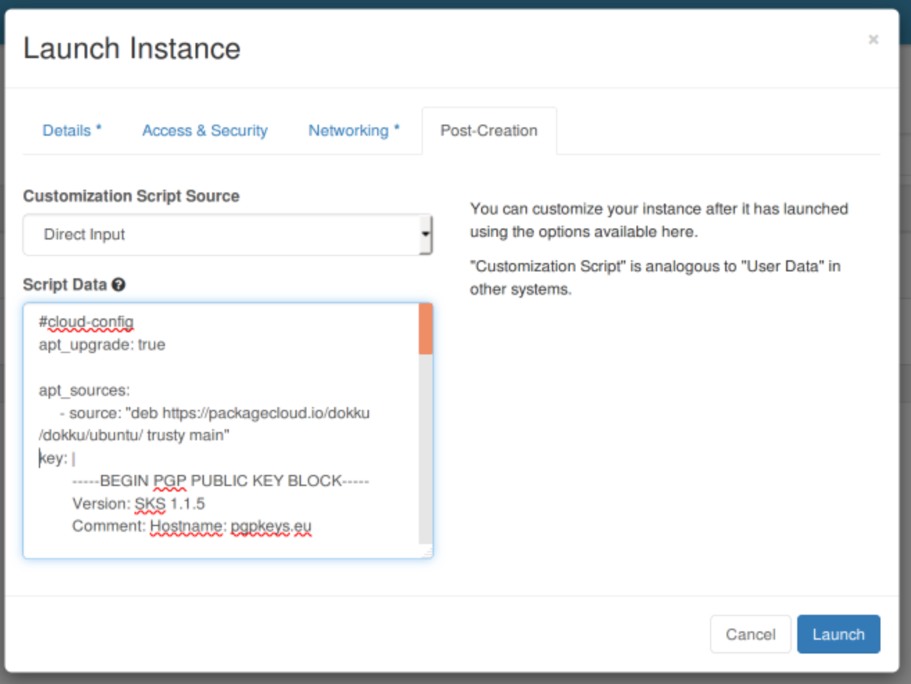

==============================================
How to deploy Dokku on Ubuntu using cloud-init
==============================================

Dokku is a small `Platform As A Service` implementation built on
Docker: it allows you to push code directly from your local machine
running git and see it running on a production server. Dokku
implements Heroku's `buildpack specification
<https://devcenter.heroku.com/articles/buildpacks>`_ allowing to run
software written in PHP, Golang, NodeJS, Python, and Ruby (including
Ruby on Rails).

This tutorial gives instructions to install Dokku in one step on a
single DreamHost Cloud server running Ubuntu 14.04LTS, using a
cloud-init script.

Create a new server
-------------------

The first step is to decide the full domain name for the new server so
that Dokku can work at its best. For this tutorial we'll use
`apps.example.com`.

With the domain name set, we can start a new DreamHost Cloud server
using the `openstack` command line client, for example. Download the
`openrc file
<228047207-How-to-download-your-DreamCompute-openrc-file>`__:

.. code:: bash

   [user@localhost]$ source openrc.sh
   [user@localhost]$ openstack server create \
       --image Ubuntu-14.04 \
       --flavor gp1.semisonic \
       --security-group default \
       --key-name $YOUR_SSH_KEYNAME \
       --user-data dokku-cloudinit.sh \
       dokku-server

It's also possible to use the web UI, pasting the content of
`dokku-cloudinit.sh` in the Post-Creation tab as Customization Script
Source.

The cloud-init script simply adds the APT repositories for Docker and
Dokku and installs Dokku from the official packages after setting the
value of some important variables like the full qualified domain name
of the new server, `apps.example.com` in this case.

.. literalinclude:: examples/dokku-cloud-init.sh

Once the server boots, get the IP address and create a DNS record for
it using `apps.example.com`. In less than 30 seconds you should be
able to push your Heroku-like apps to your new shiny PaaS.

.. meta::
    :labels: dokku
