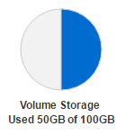
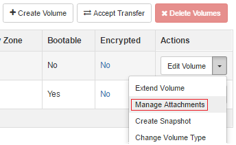
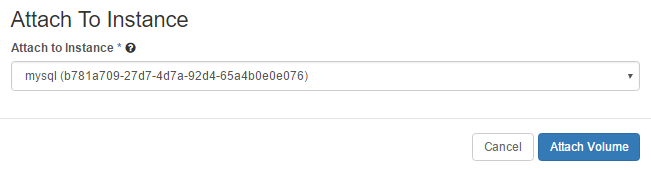

===============================================
How to create and mount volumes on DreamCompute
===============================================

Introduction
~~~~~~~~~~~~

DreamCompute, like other OpenStack clouds, have multiple kinds of storage
available to them.  The type we will deal with here is called "volume" storage
and it is recommended for storing critical and important data.  For more info
on the types of storage, please visit the article on `differences between
ephemeral and volume storage`_.

Volumes can be thought of like a hot-swap hard disk, in that you can pull it
out of one system (detach it), plug it into another system (attach it) and the
data will remain on it as it is reused.

There are several ways to do the initial steps of creating and attach the
volume, so please select the method you wish to use:

    * `DreamCompute Dashboard <#create-and-attach-a-volume-via-dashboard>`_
    * `Command Line via openstack CLI <#create-and-attach-a-volume-via-openstack-cli>`_

Create and Attach a Volume via Dashboard
~~~~~~~~~~~~~~~~~~~~~~~~~~~~~~~~~~~~~~~~

The first step is to make sure you have sufficient volume storage quota to add
a new volume.  Check the DreamCompute dashboard
`project overview <https://iad2.dreamcompute.com/project/>`_ page and the
Volume Storage pie chart.

If you need additional storage, more can be added in the DreamHost
`control panel <https://panel.dreamhost.com/index.cgi?tree=cloud.compute&>`_.

To create the new volume, in the DreamCompute dashboard `volumes <https://iad2.dreamcompute.com/project/volumes/?tab=volumes_and_snapshots__volumes_tab>`_
page click the **Create Volume** button on the top right and give the volume
a required size in GB, and an optional name and description while leaving the
other options set to the defaults.

To use your volume, it now needs to be attached to a running instance.  If you
have no instances, please create one.  In the DreamCompute dashboard, again on
the `volumes <https://iad2.dreamcompute.com/project/volumes/?tab=volumes_and_snapshots__volumes_tab>`_
page, you can click the drop-down menu and select **Manage Attachments**:

The new window will show no attachments at this time, and at drop-down with a
list of your instances.  Click on the list and select your instance name, then
click **Attach Volume**.

This completes the creation of the volume.  Please click below to continue with
creating your file system and mounting the volume.

*  `Creating A File System <#create-a-file-system>`_

Create and Attach a Volume via openstack CLI
~~~~~~~~~~~~~~~~~~~~~~~~~~~~~~~~~~~~~~~~~~~~

The first step is to make sure you have sufficient volume storage quota to add
a new volume.  Run the following command to determine this:

.. code-block:: console

    [user@localhost]$ cinder quota-usage TENANTID

which will output a table like so:

.. code-block:: console

    +----------------------+--------+----------+-------+
    |         Type         | In_use | Reserved | Limit |
    +----------------------+--------+----------+-------+
    |   backup_gigabytes   |   0    |    0     |  1000 |
    |       backups        |   0    |    0     |   10  |
    |      gigabytes       |  50    |    0     |  100  |
    | per_volume_gigabytes |   0    |    0     |   -1  |
    |      snapshots       |   1    |    0     |   64  |
    |       volumes        |   1    |    0     |   64  |
    +----------------------+--------+----------+-------+

You would want to check the "gigabytes" row, and that the column "In_use" was
lower than the "Limit" column.

If you need additional storage, more can be added in the DreamHost
`control panel <https://panel.dreamhost.com/index.cgi?tree=cloud.compute&>`_.

To create the new volume, run this command:

.. code-block:: console

    [user@localhost]$ cinder create SIZE_IN_GB --display-name NAME --display-description "Description here"

with optional extra parameters being display-name and display-description.

The volume should now show up in the dashboard, and on the command line:

.. code-block:: console

    [user@localhost]$ cinder list

To use your volume, it now needs to be attached to a running instance.  If you
have no instances, please create one.  Using the CLI requires the instance
name and the UUID of the volume.  Find the volume details by running:

.. code-block:: console

    [user@localhost]$ cinder --os-volume-api-version 2 list
    +--------------------------------------+-----------+------+------+-------------+----------+-------------+--------------------------------------+
    |                  ID                  |   Status  | Name | Size | Volume Type | Bootable | Multiattach |             Attached to              |
    +--------------------------------------+-----------+------+------+-------------+----------+-------------+--------------------------------------+
    | 26c25d21-cff5-4154-affa-a1c2d9517e32 |   in-use  |  -   |  50  |      -      |   true   |    False    | b781a709-27d7-4d7a-92d4-65a4b0e0e076 |
    | 8edfb18b-6b4b-424e-a172-cbded3aad148 | available |      |  1   |      -      |  false   |    False    |                                      |
    +--------------------------------------+-----------+------+------+-------------+----------+-------------+--------------------------------------+

In this example the instance is called "mysql" and there is only one
"available" volume, the one we created.  Once you have your values, you can
attach the volume with:

.. code-block:: console

    [user@localhost]$ nova volume-attach mysql 8edfb18b-6b4b-424e-a172-cbded3aad148 auto
    +----------+--------------------------------------+
    | Property | Value                                |
    +----------+--------------------------------------+
    | device   | /dev/vdb                             |
    | id       | 8edfb18b-6b4b-424e-a172-cbded3aad148 |
    | serverId | b781a709-27d7-4d7a-92d4-65a4b0e0e076 |
    | volumeId | 8edfb18b-6b4b-424e-a172-cbded3aad148 |
    +----------+--------------------------------------+

.. note::

    The device name listed may not always be accurate, so double-check before
    using a new device.

Create a File System
~~~~~~~~~~~~~~~~~~~~

The new drive now needs a file system so that it can store data.  There are
many choices when it comes to file systems, but for this example we'll use a
safe default of ext4.

Now connect to your instance with the default username for your image.

.. include:: common/usernames.rst
    :start-line: 2

We first need to find the device name for our new volume.  You can see what
devices are available by checking for /dev/vd* device files:

.. code-block:: console

    [user@server]$ ls /dev/vd*
    /dev/vda  /dev/vda1  /dev/vdb

Generally /dev/vda will be the boot drive, and in this case /dev/vdb appears
to be the new volume.  You can double check the size matches with the command:

.. code-block:: console

    [user@server]$ sudo fdisk -l /dev/vdb
    Disk /dev/vdb: 1 GiB, 1073741824 bytes, 2097152 sectors
    Units: sectors of 1 * 512 = 512 bytes
    Sector size (logical/physical): 512 bytes / 512 bytes
    I/O size (minimum/optimal): 512 bytes / 512 bytes

This matches the 1GB size of the volume I created.  Now, to create a file
system on the drive, run the mkfs command.

.. note::

    This command is destructive!  If ran on the wrong device, it will erase
    it so please be sure you have it correct!

.. code-block:: console

    [user@server]$ sudo mkfs.ext4 /dev/vdb
    mke2fs 1.42.13 (17-May-2015)
    Creating filesystem with 262144 4k blocks and 65536 inodes
    Filesystem UUID: 51751b87-a583-42b3-8d61-27ed586ba8da
    Superblock backups stored on blocks:
            32768, 98304, 163840, 229376

    Allocating group tables: done
    Writing inode tables: done
    Creating journal (8192 blocks): done
    Writing superblocks and filesystem accounting information: done

The file system is now created.

Mount the File System
~~~~~~~~~~~~~~~~~~~~~

As mentioned before, the device for the drive can change should udev or other
changes happen, and such an error can prevent your instance from booting up
properly.  To avoid this, we will boot via UUID.  You can find the drives UUID
by running the blkid command:

.. code-block:: console

    [user@server]$ sudo blkid /dev/vdb
    /dev/vdb: UUID="51751b87-a583-42b3-8d61-27ed586ba8da" TYPE="ext4"

If you wish to mount this volume in a location that doesn't exist, go ahead and
create the directory with mkdir:

.. code-block:: console

    [user@server]$ sudo mkdir -p /mnt/backups

With this info we can now modify /etc/fstab to have it auto mounted.  Edit it
with your preferred editor, which in this example will be vim, and add a line
towards the bottom like so:

.. code::

    UUID=51751b87-a583-42b3-8d61-27ed586ba8da   /mnt/backups   ext4   defaults   0   2

Once that is added, you can test your setup with:

.. code-block:: console

    [user@server]$ sudo mount -a

If all succeeded, you should see no output or only output about the file
system.  You can check that all is well with "df":

.. code-block:: console

    [user@server]$ df -h /mnt/backups
    Filesystem      Size  Used Avail Use% Mounted on
    /dev/vdb        976M  1.3M  908M   1% /mnt/backups

Checking specifically for the /dev/vdb device at the front.

That's it!  When you reboot your instance, your volume will be re-mounted and
ready for use, if you need to reboot.

.. _differences between ephemeral and volume storage: 217701757-What-s-the-difference-between-ephemeral-and-volume-boot-disks

.. meta::
    :labels: volume attach mount dreamcompute mkfs mkfs.ext4 fdisk
