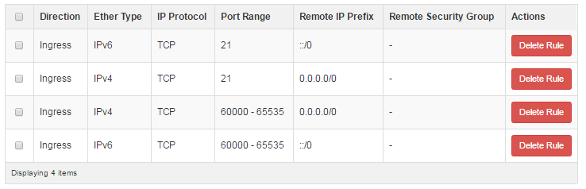

===============================================================
How to install ProFTPD on DreamCompute running Debian or Ubuntu
===============================================================

ProFTPD is a feature-rich open-source FTP server software solution for Linux
and other Unix-like operating systems.  FTP or File Transfer Protocol is a fast
but insecure method of managing files on a remote server.  For better security,
using SFTP is recommended and requires no additional software on DreamCompute
instances as this is supported by SSHD.  An FTP server can also be useful for
providing anonymous FTP, most commonly used to distribute files publicly via
without requiring a login.

As mentioned above, FTP is insecure and all data, login information (and
therefore passwords), and commands can be intercepted in plain text.  It is
recommended to use SFTP or at a minimum FTP secured with TLS.

Installation
~~~~~~~~~~~~

The instructions for the installation are the same on all Debian and Ubuntu
systems.  There is a package available called "proftpd" that contains the
server and associated programs.

Package installation
--------------------

.. code:: bash

    sudo apt-get update
    sudo apt-get install proftpd

During installation, some additional needed packages are included which require
a confirmation.  Also, near the end of the installation a prompt is displayed
about how to run ProFTPD.

.. code::

    ProFTPD can be run either as a service from inetd, or as a standalone server.
    Each choice has its own benefits. With only a few FTP connections per day, it is
    probably better to run ProFTPD from inetd in order to save resources.

    On the other hand, with higher traffic, ProFTPD should run as a standalone
    server to avoid spawning a new process for each incoming connection.

      1. from inetd  2. standalone

    Run proftpd:

Answer "2" or "standalone" at this dialog to complete the installation.

Security group modification
---------------------------

In order to access FTP, the security group needs to be modified to allow FTP
specific ports.  The ports needed are 21 (FTP) and a range of ports for passive
FTP.  In this example, ports 60000-65535 are used, however the range can be
different if desired.  FTP only works on TCP, so security group rules only need
to be added for TCP.

There are two different ways to configure the security group.  The first option
is to add more rules to the "default" security group, and the other option is
to make a whole new security group and include just those rules for FTP.  The
security group can be added to the instance(s) that need it to allow those
ports.

Here is an example of what a security group looks like that is setup as a new
security group just for FTP, and it is called "FTP".

These rules can be added to the "default" security group instead if desired.

Passive FTP
-----------

Most FTP clients make use of passive FTP, which is a connection method that is
more reliable when firewalls are involved.  Edit the /etc/proftpd/proftpd.conf
file and find this line:

.. code:: bash

    # PassivePorts                  49152 65534

Uncomment it by removing the "#" symbol, and update the "49152 65534" range
to "60000 65535" or your desired range.  Afterwards it should look like:

.. code:: bash

    PassivePorts            60000 65535

Save the file, and restart ProFTPD to apply this change.

.. code:: bash

    service proftpd restart

Optional features and configurations
~~~~~~~~~~~~~~~~~~~~~~~~~~~~~~~~~~~~

Out of the box, ProFTPD works for normal user logins that have passwords set on
the server.  Here are some additional features and configuration changes that
improve the experience.

Security improvements
---------------------

Edit the /etc/proftpd/proftpd.conf file and modify these existing commented-out
lines or add them new:

.. code:: bash

    DefaultRoot ~
    ServerIdent on "FTP Server ready."

The DefaultRoot entry ensures that users that login are confined to
their home directories, and the ServerIdent entry doesn't disclose server type
or versions to any users to avoid targeted attacks.

Private networking specific change
----------------------------------

If private networking and floating ips are in use on an instance, the FTP
server believes it is working on the private network IP address only.  This
causes issues with passive FTP connections.  To fix this, edit
/etc/proftpd/proftpd.conf and find this setting:

.. code:: bash

    # MasqueradeAddress             1.2.3.4

Uncomment it by removing the "#" symbol, and update the 1.2.3.4 example address
with your floating IP address.

This setting is not necessary for instances only making use of the public
network.

Save the file, and restart ProFTPD to apply this change.

.. code:: bash

    service proftpd restart

Anonymous FTP
-------------

There are a number of ways to configure this option.  Please see the
`ProFTPD Directory documentation <http://www.proftpd.org/docs/howto/Directory.html>`_
for all options.  The default configuration file contains a basic download-only
setup, and by uncommenting it and restarting ProFTPD it can be enabled.  The
configuration starts with a <Anonymous ...> tag and completes with a
</Anonymous> tag.  The files used for anonymous FTP are stored in /srv/ftp
in most setups.

After uncommenting the code, restart ProFTPD to enable it.

To test that it is working, use the basic ftp client to login with the
"anonymous" username and an email address as the password.  Here is output
from a working system:

.. code:: bash

    $ ftp localhost
    Connected to localhost.
    220 FTP Server ready.
    Name (localhost:debian): anonymous
    331 Anonymous login ok, send your complete email address as your password
    Password:
    230-Welcome user anonymous@localhost !
    230-
    230-The local time is: Fri Oct 07 20:26:36 2016
    230-
    230 Anonymous access granted, restrictions apply
    Remote system type is UNIX.
    Using binary mode to transfer files.
    ftp> ls
    200 EPRT command successful
    150 Opening ASCII mode data connection for file list
    -rw-r--r--   1 ftp      ftp           170 May 19  2015 welcome.msg

FTPS or FTP with TLS
--------------------

While an optional feature and not fully supported by all FTP clients, if FTP
must be used instead of SFTP then using TLS is highly recommended.

The first step is to enable the TLS configuration file.  Edit the
/etc/proftpd/proftpd.conf file, and uncomment the line related to tls.conf.  It
looks like so:

.. code:: bash

    #Include /etc/proftpd/tls.conf

Once the "#" is removed, save the file.

Next, determine if a self-signed certificate is needed or if an existing
certificate is available to use.  If the instance has a HTTP server and is
using Let's Encrypt, that certificate can be used.  To use that certificate,
find where it is stored (generally /etc/letsencrypt/live/YOURDOMAIN/) and
edit the /etc/proftpd/tls.conf file by uncommenting and modifying the options
to look like so:

.. code:: bash

    TLSRSACertificateFile         /etc/letsencrypt/live/YOURDOMAIN/cert.pem
    TLSRSACertificateKeyFile      /etc/letsencrypt/live/YOURDOMAIN/privkey.pem
    TLSCertificateChainFile       /etc/letsencrypt/live/YOURDOMAIN/chain.pem

If there is not a certificate available, a self-signed one can be created by
running the following command (as recommended in the proftpd.conf file):

.. code:: bash

    sudo openssl req -x509 -newkey rsa:1024 -keyout /etc/ssl/private/proftpd.key \
    -out /etc/ssl/certs/proftpd.crt -nodes -days 365
    sudo chmod 0600 /etc/ssl/private/proftpd.key
    sudo chmod 0640 /etc/ssl/certs/proftpd.crt

Similar to the Let's Encrypt certificate setup, edit the /etc/proftpd/tls.conf
file by uncommenting and modifying the options to look like so:

.. code:: bash

    TLSRSACertificateFile                   /etc/ssl/certs/proftpd.crt
    TLSRSACertificateKeyFile                /etc/ssl/private/proftpd.key

In addition to the above, uncomment any other lines needed for the setup
desired.  The minimal settings needed are generally:

.. code:: bash

    TLSEngine                     on
    TLSLog                        /var/log/proftpd/tls.log
    TLSProtocol                   SSLv23
    TLSOptions                    NoSessionReuseRequired AllowClientRenegotiations

Save the file, and restart ProFTPD to apply this change.

.. code:: bash

    service proftpd restart

Debugging
~~~~~~~~~

ProFTPD generally works from the moment it is installed, however there are
some issues that can pop up.  In most cases, checking the output of
"service proftpd start" and the log files /var/log/proftpd/proftpd.conf and
/var/log/syslog can clarify issues.

error: no valid servers configured
----------------------------------

.. code:: bash

    HOST proftpd[5799]: warning: unable to determine IP address of 'HOST'
    HOST proftpd[5799]: error: no valid servers configured
    HOST proftpd[5799]: Fatal: error processing configuration file '/etc/proftpd/proftpd.conf'

This error can occur if the hostname cannot be resolved to an IP address.
Check that the /etc/hosts file contains the public IP address and hostname.  If
not, add a single line with the public IP address, a few spaces, and then the
hostname.  For example, "208.113.131.80      myftpserver".  This allows ProFTPD
to start.

.. meta::
    :labels: proftpd debian ubuntu
