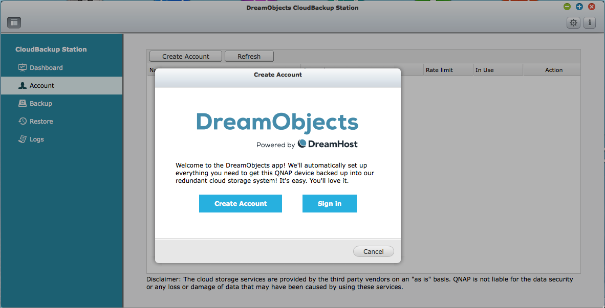

How to configure DreamObjects App for QNAP NAS
==============================================

If you have a QNAP network attached storage (NAS) device, you can now
back it up to DreamObjects! There is now an application available for
your QNAP that allows you to easily back up your data to DreamObjects
for disaster recovery and long-term archiving.

Installation
------------

Log in to your QNAP device and launch the `App Center`_. Search for
DreamObjects in the search box and click the app. Click the button to
add it to your device.

Configuration
-------------

To use the DreamObjects app, you'll need to either sign in with your
existing DreamHost account or create a new one. If you're new to
DreamHost, click the link to create an account. Otherwise, follow the
link to sign in to the DreamHost control panel and authorize your QNAP
device on your account.

.. _App Center: https://www.qnap.com/i/en/app_center

.. meta::
    :labels: nas backup object
