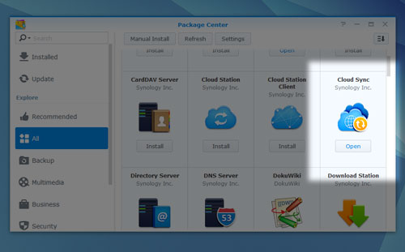
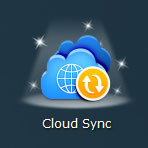
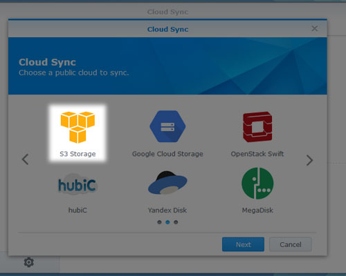
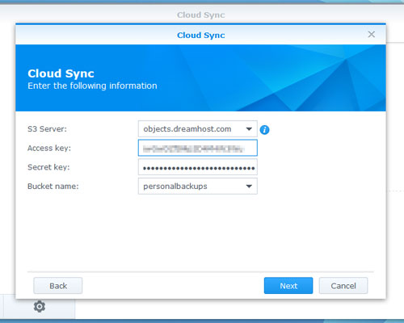
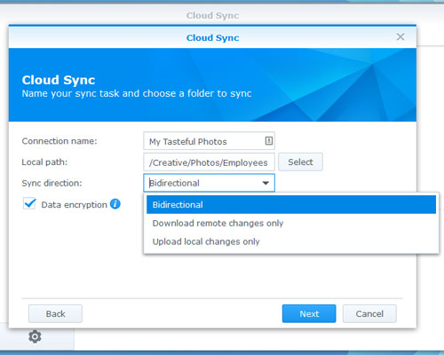
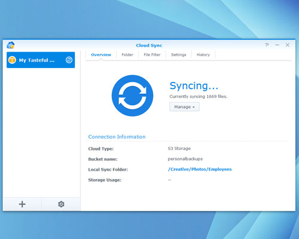
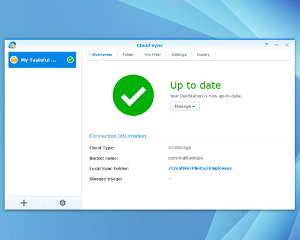

How to sync Synology NAS to DreamObjects
========================================

NAS devices are great, but what if your house goes up in flames? You
could stand to lose everything! Family photos from years ago, all of
your music, videos, tax returns, digital financial documents… all
gone!

That’s why you should back up your NAS regularly. Synology’s made this
easy by providing both native cloud backup functionality and an
optional (free) cloud "sync" app.

Setting up Synology’s Cloud Sync
--------------------------------

You’ll need  a private bucket on DreamObjects — this where your data
will live. All in all, you need tohave three things: a *public key*, a
*secret key*, and a *bucket name*.

Once you’re all set on the DreamHost side of things, log in to your
Synology device. Doesn’t matter if it’s a RackStation or a
DiskStation, or whatever! The great thing about the Synology platform
is that every model runs the same `DSM management software`_!

Click over to the Package Center, navigate to the `Cloud Sync`_ app,
and click to Install/Open it!

If you just installed Cloud Sync, navigate to your list of installed
apps where you’ll see that it now stands proudly, beaming beneath a
spotlight while twinkles of newness surround it on all sides.

Launch Cloud Sync. You’ll be asked to select a public cloud to use.
Navigate to *S3 Storage*.

Your *S3 Server* should be :command:objects-us-west-1.dream.io. Once you provide
your access key (public key) and secret keys, all of your available
DreamObjects buckets will populate the dropdown list. Select the one
that you want to use (you might only have one.)

Now you’ll need to give this sync job a name and tell Cloud Sync which
directories to include.

You’ll also need to choose which direction your sync should operate —
if you’re counting on DreamObjects to maintain the latest copies of
all your data silently in the background until disaster strikes,
“Upload local changes only” is what you’ll want. If you intend to make
some changes to the data within your buckets directly (this is not
likely if you’re using DreamObjects in this context) go with
“Bidirectional”.

Data Encryption is an option that you should consider enabling. Your
files will be encrypted before they’re ever transmitted to
DreamObjects, and not even DreamHost will be able to decrypt them for
you – all encryption is handled automatically on your end by the Cloud
Sync app.

Note that Synology’s data encryption comes with one disappointing
shortcoming — your file names will not be encrypted.

Now select which subdirectories you’d like to include in your sync:

.. figure:: images/dirs.jpg

Click Apply, and if all goes as planned, you should now see a screen
like this:

Your personal data is now syncing to DreamObjects, and you can kick
back and never worry about having to retrieve it until you have to!

Soon you’ll see this screen, and all will be right with the world.

To restore your data after a colossal breakdown, just repeat this
whole process on new Synology hardware with the “Download remote
changes only” option. Easy!

Synology’s own `Backup & Replication`_ app is another option for
performing more traditional backups. However, while it also supports
S3, it doesn’t allow you to specify your own hostname! This one fatal
flaw limits its functionality terribly.

.. _Cloud Sync: https://www.synology.com/en-global/dsm/app_packages/CloudSync
.. _DSM management software: https://www.synology.com/dsm
.. _Backup & Replication: https://www.synology.com/en-us/dsm/data_backup

.. meta::
    :labels: nas object backup
