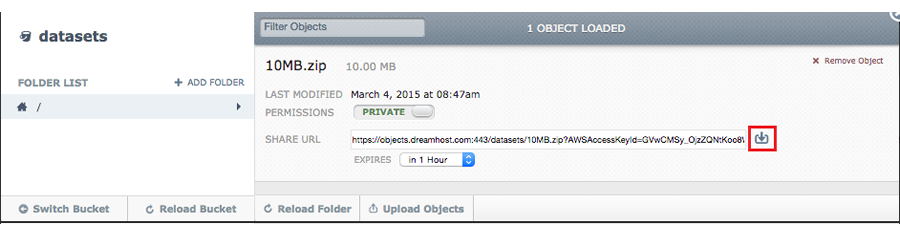
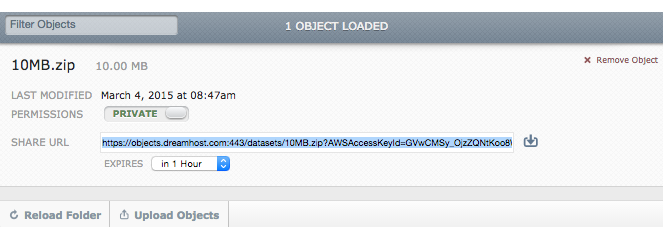

=======================================
How to download files from DreamObjects
=======================================

There are a wide variety of ways to download files from DreamObjects,
mainly depending on your preferences and skills and the permissions
set on the bucket and the object.

DreamObjects supports basic permissions in the panel as well as ACLs
compatible with Amazon S3 on buckets and objects. In the panel,
permissions can be set as either Public or Private. Public buckets and
objects can be accessed by anyone. Private buckets and objects can
only be accessed via a signed URL or through the API with the proper
credentials.

DreamObjects also `supports Access Control Lists (ACL)`_ compatible
with Amazon S3 to specify permissions on buckets and objects.

- using the `DreamObjects control panel`_: If you are the owner of the
  DreamObjects account, you can log into the panel and navigate to the
  `Panel > Cloud Services > DreamObjects`_ page. From there, you can
  download the file from the file browser, which is also known as the
  'Object Viewer'. After selecting your object, click the download
  link to the right to save the file.

- using **Signed URL**: a signed URL allows an object to be accessed
  regardless of its permissions. In the `DreamObjects control panel`_,
  open your bucket and navigate to the object in the DreamObjects file
  browser. Right-click the download link to copy a URL. By default,
  this link is valid for one hour.

- using the **simple URL**: any object with public read permissions may be
  downloaded through any web browser simply by browsing to its URL.
  For example, an object called 'MY_OBJECT' in the bucket called
  'MY_BUCKET' can be downloaded by browsing to
  `https://objects-us-west-1.dream.io/MY_BUCKET/MY_OBJECT`.

Objects are limited to 10TBs, but must be uploaded in 5GB chunks.
Please note, not all clients are able to do multipart uploads. For
anything above 5GB, you must use a client that supports multi-part
uploads.

DreamObjects is designed for 99.99999% durability over a given year
and your data is replicated three times, with immediate consistency,
throughout the DreamObjects' data center ensuring further backup
security.

DreamObjects is capable of storing almost any type of file, so long as
it meets the conditions of the `Acceptable Use Policy`_.

.. _DreamObjects control panel: https://panel.dreamhost.com/index.cgi?tree=cloud.objects&
.. _Panel > Cloud Services > DreamObjects: https://panel.dreamhost.com/index.cgi?tree=cloud.objects&
.. _Acceptable Use Policy: http://dreamhost.com/acceptable-use-policy/
.. _supports Access Control Lists (ACL): 215916697-Understand-DreamObjects-S3-compatible-Access-Control-List

.. meta::
    :labels: desktop upload object bucket
