================================
How to Use Arq with DreamObjects
================================

Overview
~~~~~~~~

.. figure:: images/Arq-icon.png

`Arq <https://www.arqbackup.com>`_ is a Mac and Windows app that allows you to
make online backups that support DreamObjects. Arq backups are encrypted with
a password before they're uploaded so your data is protected.

The installation and configuration of Arq varies depending on the operating
system.  Click your operating system below to jump to the proper instructions.

* `Windows <#connecting-with-arq-on-windows>`_
* `Mac <#connecting-with-arq-on-mac>`_

Connecting with Arq on Windows
~~~~~~~~~~~~~~~~~~~~~~~~~~~~~~

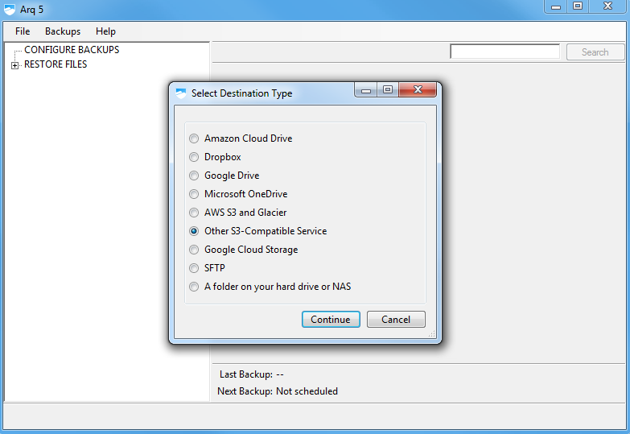

   Launch Arq.  When launching Arq for the first time, you are prompted to
   choose your backup destination type.  Click the 'Other S3-Compatible
   Service' option, and then click **continue**.

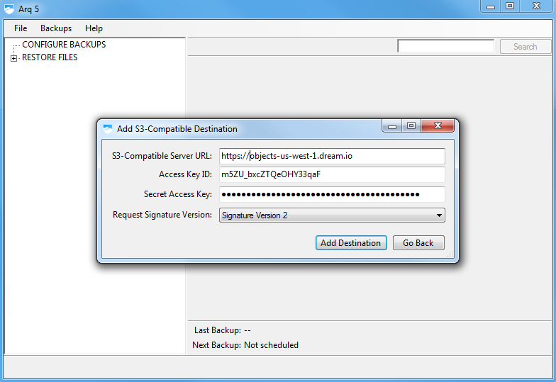

   For the S3-Compatible Server URL, enter the hostname
   'https://objects-us-west-1.dream.io'. Next ensure that the signature version
   defaults to 'Signature Version 2', and then fill in the access and secret
   keys with the values from the DreamHost panel.  Click **continue** to
   advance to the next step.  Read how to find your `DreamObjects Keys`_.

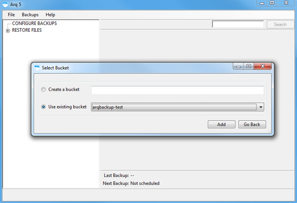

   Arq will prompt you to enter a new bucket name, or select an existing
   bucket.  Choose the option you want and enter a name if necessary, then
   click **Add** to complete.

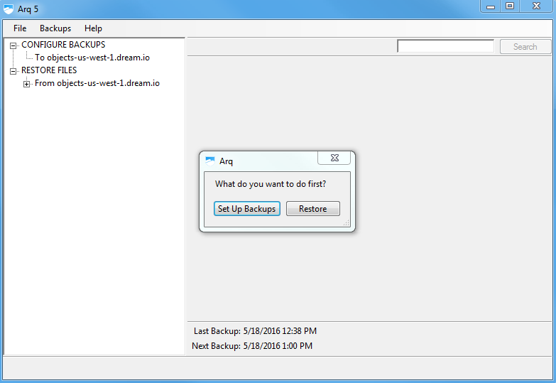

   After your bucket is configured, Arq will ask if you want to setup a new
   backup schedule, or to restore files from this bucket (which requires
   existing backups in your bucket).  Click **Set Up Backups**.

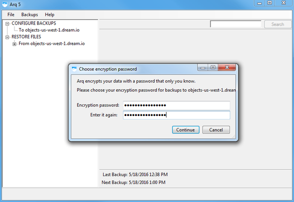

   Create an encrypted password for your backup which allows additional
   security for the backup created.

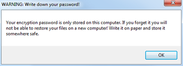

   After you enter an encrypted password, be sure to write down the password
   you created and store it somewhere safe.

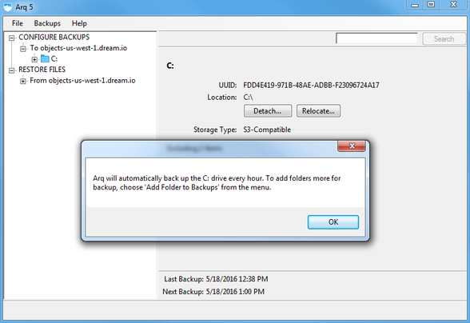

   On Windows systems, Arq defaults to backing up the entire C: drive
   excluding only the Recycle Bin and the pagefile.sys file.

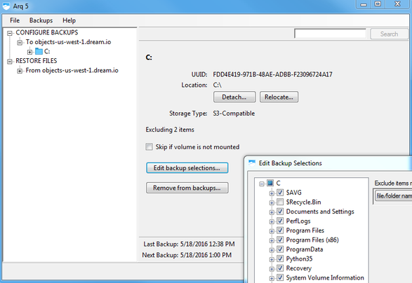

   To add or remove files or folders, click the **Edit backup suggestions**
   button, which will allow you to customize the selection.

Arq is now configured to backup your data.

Connecting with Arq on Mac
~~~~~~~~~~~~~~~~~~~~~~~~~~

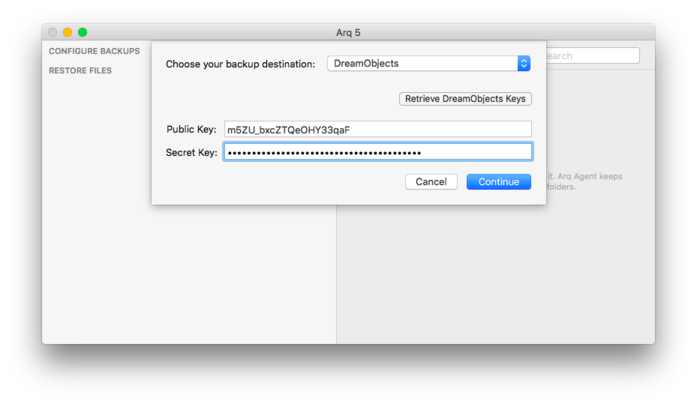

   Launch Arq.  When launching Arq for the first time, you are prompted to
   choose your backup destination type.  Select 'DreamObjects' from the
   drop-down list.  Fields to enter the access and secret keys will appear
   as well as a button to open the DreamHost panel to find your keys.  Enter
   your desired keys.   Read how to find your `DreamObjects Keys`_.

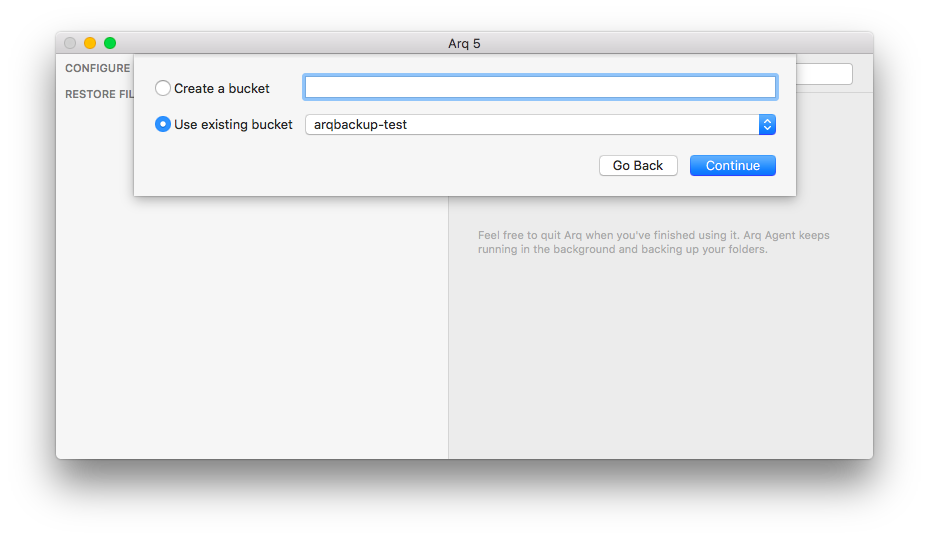

   After you enter the DreamObjects access Key and secret Key, enter a new
   bucket name or select an existing bucket from the drop down list.

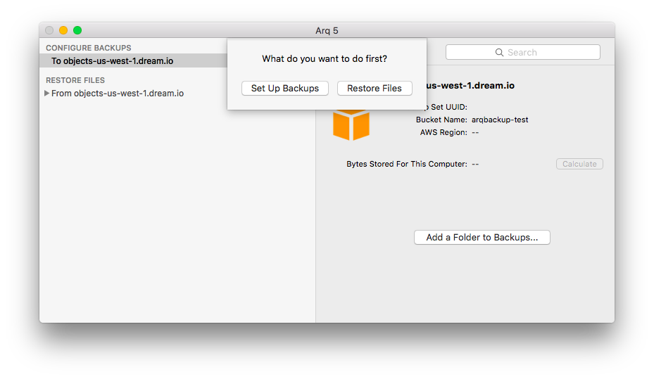

   After your bucket is configured, Arq will ask if you want to setup a new
   backup schedule, or to restore files from this bucket (which requires
   existing backups in your bucket).  Click **Set Up Backups**.

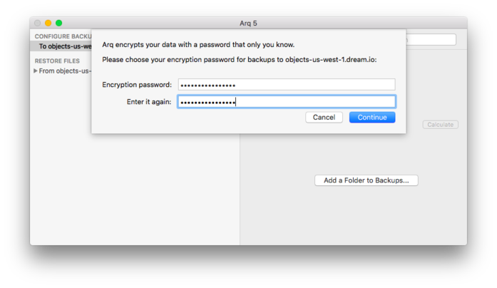

   Create an encrypted password for your backup which allows additional
   security for the backup created.

.. figure:: images/Arq-5-mac.png

   After you enter an encrypted password, be sure to write down the password
   you created and store it somewhere safe.

.. figure:: images/Arq-6-mac.png

   On Mac systems, Arq defaults to backing up the /Users directory, excluding
   files it knows are unnecessary like cache and page files.

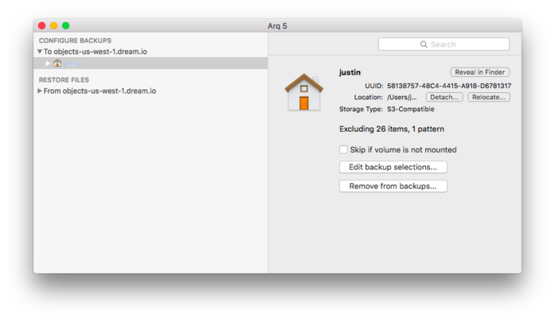

   To add or remove files or folders, click the **Edit backup suggestions**
   button, which will allow you to customize the selection.

Arq is now configured to backup your data.

.. _DreamObjects Keys: 215986357-What-are-Keys-in-DreamObjects-and-How-Do-You-Use-Them-

.. meta::
    :labels: arq windows mac backup
