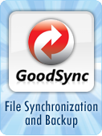
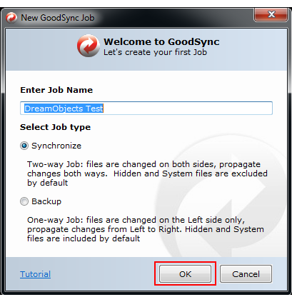
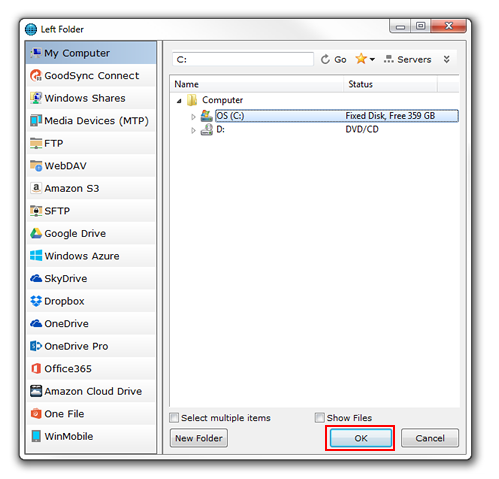
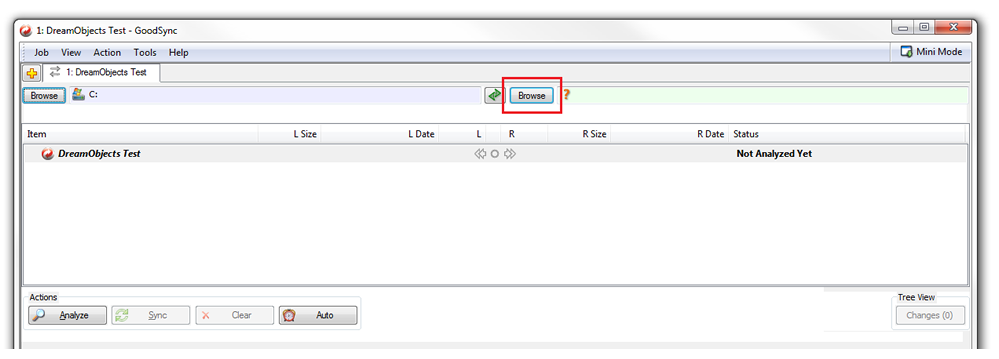
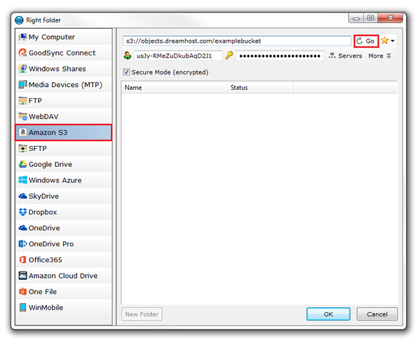
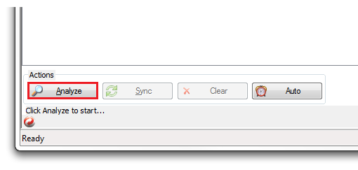
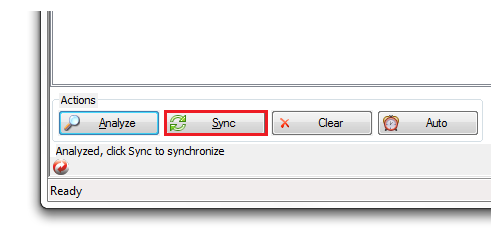

=================================
How to GoodSync with DreamObjects
=================================

Overview
~~~~~~~~

`GoodSync <http://www.goodsync.com/>`_ is an easy, secure, and
reliable file synchronizer. The free version is limited to 3 jobs or
less and 100 or less files and folders in each job. Pricing is $29.95
for the Windows version, and $39.95 for the Mac version.

   .. note::  Many customers have reported issues with GoodSync
              failing with files larger than 100MB.
              Until a solution is found, it’s recommend that you use another
              client.

Connecting to GoodSync (Windows version)
~~~~~~~~~~~~~~~~~~~~~~~~~~~~~~~~~~~~~~~~

1. Launch GoodSync.  If this is the first instance of GoodSync, The
   'New GoodSync Job' screen opens:

2. Enter a job name in the ‘Enter Job Name’ box. You can name it
   anything you wish.  You can also choose between ‘Synchronize’ and
   ‘Backup’ although the ‘Synchronize’ option is most often used.

3. Click **OK** to proceed.

.. figure:: images/02_Goodsync.fw.png

4. When the main page opens, click the Browse button on the top left.
   A file explorer window opens:

5. Select which directory on your local machine you’d like to sync
   from, and then click OK.

6. When you return to the main page, click the Browse button on the
   top right.

7. In the list on the left, select the ‘Amazon S3’ option and enter
   your DreamObjects credentials:

   - Address – s3://objects.dreamhost.com/yourbucketname
     (make sure to enter the name of the bucket you’re connecting to).
   - Access/Secret Keys – You can find these in your panel.
     View the `DreamObjects keys </hc/en-us/articles/215986357>`_
     article for further details.

8. Make sure the ‘Secure Mode (encrypted)' box is checked.
9. Click Go on the top right to connect.
10. Click OK on the bottom right to close this window.

11. When you return to the main page, click the Analyze button on the
    bottom left.

12. Click the Sync button on the bottom left.

The data on your local machine is then synced with your DreamObjects
bucket.

.. meta::
    :labels: cloudberry backup
