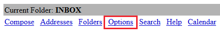
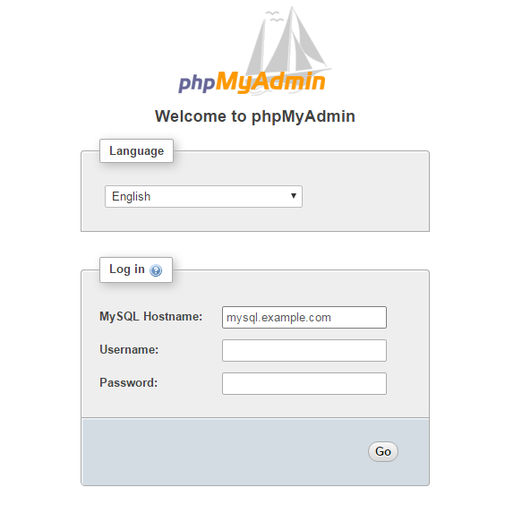

=======================================================
DreamCompute and DreamObjects documentation style guide
=======================================================

.. csv-table::
    :header: "Table of Contents"

    `Checklist <#checklist>`_
    `RST formatting style <#rst-formatting-style>`_
    `Grammar and mechanics <#grammar-and-mechanics>`_
    `Voice and tone <#voice-and-tone>`_
    `Formatting <#formatting>`_
    `Further reading <#further-reading>`_

Checklist
~~~~~~~~~

Use this checklist to determine if your documentation adheres to the
major technical style guide rules we observe. Further details are provided on
each rule later in this guide.

* Be concise. Avoid unnecessary text, which can quickly
  become wordy and confusing.
* Use the third-person. For example, never use the words
  'we', 'us', 'our', and so on. Always use the company name
  DreamHost.
* Avoid run-on sentences and stream-of-thought text. Every
  sentence should be immediately clear and useful.
* Avoid humor. It's generally a good idea to avoid any attempt
  at humor in customer-facing technical documentation.
* Don't use the future tense. Users are typically visiting our
  articles to accomplish a goal right now, and when someone
  sees the word "will", it presents ambiguity.
* Limit exclamation points! They are distracting and lose their
  emphasis if overused!!
* Always use "example.com" when illustrating example
  domains.
* Use PNG for an image format. Icons can also use a SVG
  format. Do NOT use JPG files.
* If you must include callout to highlight a section of an
  image, only use a single box. Do not use arrows, circles, or
  more than a single box.
* Try to break up a 'wall of text' with a bullet or numbered list,
  table, graphic, or outside link.

RST formatting style
~~~~~~~~~~~~~~~~~~~~

* Lines should be wrapped at 80 characters for readability.
* Trailing whitespaces should also be watched out for and prevented.
* If your article describes how to write code of some sort (i.e., python,
  ansible, and so on) add a file that contains just the program and put it in
  examples/filename (relative to the article) and include it at the end of
  your article.
* Article titles should use "down style": only capitalize the first word in
  article titles and section headings, except when a proper noun exists which
  is always capitalized.
* Use 4 spaces instead of one hard tab for indentation.

Headers
-------

RST does not have strict requirements on header hierarchy, but keeping a
consistent hierarchy makes thing easier to read. In DreamHost Cloud docs,
titles and H1 are surrounded by =, H2 underlined by ~, H3 underlined by -, H4
underlined by ^, H5 underlined by \*, and H6 underlined by " as shown in the
following examples:

.. code-block:: rst

    =================
    Title or Header 1
    =================

    Header 2
    ~~~~~~~~

    Header 3
    --------

    Header 4
    ^^^^^^^^

    Header 5
    ********

    Header 6
    """"""""

which looks like

=================
Title or Header 1
=================

Header 2
~~~~~~~~

Header 3
--------

Header 4
^^^^^^^^

Header 5
********

Header 6
""""""""

Tables
------

RST allows for several different ways of creating tables. The easiest way is
described in the following example, although it is not extremely flexible:

.. code-block:: rst

    ======== ========
    Column 1 Column 2
    ======== ========
     Data 1   Data 2
     Data 3   Data 4
    ======== ========

which looks like:

======== ========
Column 1 Column 2
======== ========
 Data 1   Data 2
 Data 3   Data 4
======== ========

The second way is harder to manage, but more flexible:

.. code-block:: rst

    +----------+----------+----------+
    | Column 1 | Column 2 | Column 3 |
    +==========+==========+==========+
    | Data 1   | Data 2   | Data 3   |
    +----------+----------+----------+
    | Data 4   |       Data 5        |
    +----------+---------------------+

which ends up looking like:

+----------+----------+----------+
| Column 1 | Column 2 | Column 3 |
+==========+==========+==========+
| Data 1   | Data 2   | Data 3   |
+----------+----------+----------+
| Data 4   |       Data 5        |
+----------+---------------------+

The final way is the easiest to manage but hardest to visualize before built to
HTML:

.. code-block:: rst

    .. csv-table:: Table Title
       :header: "Column 1", "Column 2"
       :widths: 20, 40

       "Data 1", "Data 2"
       "Data 3", "Data 4"

which looks like:

.. csv-table:: Table Title
   :header: "Column 1", "Column 2"
   :widths: 20, 40

   "Data 1", "Data 2"
   "Data 3", "Data 4"

Code blocks
-----------

It is common to include code examples in tutorials. DreamHost Cloud docs are
built with sphinx, which allows you to include code by using the following:

.. code-block:: rst

    .. code-block:: language

        code goes here

Replace "language" with the language that you are demonstrating, for example a
command on the console would use "console" as the language, and a bash script
would use "bash".

Which looks like:

.. code-block::

    code goes here

Shell commands
^^^^^^^^^^^^^^

When giving examples of shell commands, use the code-block directive with
"console" as the language. Before the command add a PS1, depending on what user
and where the command should be run. for example:

.. code-block:: console

    [user@localhost]$ ansible-playbook site.yml

Shows to run ``ansible-playbook site.yml`` as a normal user on the local
machine.

.. code-block:: console

    [root@server]# apt install apache2

Shows to run ``apt install apache2`` as the root user on the server.

Lists
-----

Ordered lists should be done like the following:

.. code-block:: rst

    #. Item 1

        #. Item 1a

    #. Item 2

        #. Item 2a

    #. Item 3

        #. Item 3a

and unordered lists should be done with "*", such as:

.. code-block:: rst

    * List Item

    * List Item

    * List Item

Images
------

Images are useful, but not required in DreamHost Cloud documentation. If you
want to have an image in an article, put the image in the ./images directory
relative to the article and reference it from there, using the following:

.. code-block:: rst

    .. figure:: images/image.png

        Image caption goes here

Bold and italicized text
------------------------

Bold and italicized text are allowed in DreamHost Cloud documentation to
emphasize key words or points, they can be done by surrounding a word with \*
or \*\*.

Using domain names in documentation
-----------------------------------

When using an example domain name in an article, use "example.com".

Links
-----

In most cases, use the following for links:

.. code-block:: rst

    `text to be clickable <https://example.com>`__

Note: There are two underscores, which tells the RST
compiler to throw away the reference when it is done, so you can later link the
same text to a different target. If there is one underscore, it then
creates a link and saves the text as a reference, so the next time you use it
you don't have to add the target, just the text, as in the following example:

.. code-block:: rst

    `text to be clickable`_

See
http://docutils.sourceforge.net/docs/user/rst/quickref.html#hyperlink-targets
for more information on links.

Standard phrasing for introducing paragraphs
--------------------------------------------

When introducing a new paragraph about an installation or configuration
process, include "The following describes how to configure/install X..." If you
have bulleted points describing how to install or configure something, phrase
it as "Configure/Install X...".

Grammar and mechanics
~~~~~~~~~~~~~~~~~~~~~

Good grammar is like good code: when it's bug free, things work and don't
break. The following are basic grammar guidelines that ensure
consistency, allowing the reader to quickly comprehend
the information you present.

Spelling, grammar, and punctuation
----------------------------------

Typos must always be corrected, obviously. Spell checker is
never 100% accurate, so reading through every article is imperative.
This greatly helps you find grammar mistakes (a biggie is correcting
subject/verb agreement), fixing missing or incorrect punctuation, and
correcting those common gotchas (such as "there/their", "form/from",
"then/than", and so on). It also helps in fixing sentence fragments and
run-on sentences.

Avoid run-on sentences
----------------------

It's very easy to cram several technical details into a single run-on
sentence. This usually happens as a "stream of thought" when the
writer is more focused on her knowledge of the content rather than
the user's experience reading it. Make sure every sentence is clear
and concise so the information is not lost on the user.

Avoid exclamation points
------------------------

It's easy to get carried away with exclamation points to highlight important
information. However, this can quickly become distracting to the
reader. Rely instead on using language to emphasize importance and limit the
use of exclamation points, except only in the most urgent situations!

Capitalize article title and section headings
---------------------------------------------

We use "down style" — we only capitalize the first word in article titles and
section headings, except when a proper noun exists, which is always
capitalized.  An example of proper noun usage is when a DreamHost service is
mentioned, such as "Unique IP."

Also, in most cases, don't capitalize the first word after a colon (:),
semicolon (;), or en/em dashes (–, —), unless it's a proper noun. There are
exceptions, of course.

Using a serial comma (or, "the Oxford comma")
---------------------------------------------

In a list, we always use a serial comma to avoid confusion.
Example: "I had eggs, toast, and orange juice." (The final comma prevents
confusion).

Using acronyms
--------------

Always spell out an acronym on first instance (and put the actual acronym in
parentheses directly after it), unless it's a commonly used one, such as HTML,
PHP, and so on. In general, if it's a vaguely known or not commonly used term,
spell it out.
Example: Comprehensive Perl Archive Network (CPAN).
Also, you don't need an apostrophe in an acronym to designate plural usage:

    FAQs, CD-Rs, 1980s, and URLs

But, use an apostrophe to indicate possession:

    The SSL's encryption method can fail.

A word about how to spell certain acronyms
^^^^^^^^^^^^^^^^^^^^^^^^^^^^^^^^^^^^^^^^^^

Always capitalize programming languages, and also pay close attention to
internal capitalization rules for others. This is how to spell some of the
major ones that are commonly used:

    PHP, Ruby, JavaScript, HTML, XML, Perl, Ajax, JSON, JQuery, Unix, Python, 
    MySQL, phpMyAdmin, and CSS.

And, also:

    DreamHost, Panel, WordPress, WHOIS, Webmail, SquirrelMail, Roundcube, 
    Wikipedia, and Internet.

When in doubt, visit the official website (or `Wikipedia
<https://www.wikipedia.org/>`__) and find out how a
company, language, or acronym is spelled.

Can I use an ampersand (&) in a sentence?
^^^^^^^^^^^^^^^^^^^^^^^^^^^^^^^^^^^^^^^^^

Generally speaking, spell out "and" and do not use an ampersand in
a heading or sentence to replace it. Using an ampersand (and other symbols)
presents an overly casual and informal tone, which you should try to avoid in
technical documentation.

There are exceptions—such as AT&T, R&D, Smith & Wesson, and especially if it
appears in a command (leave it alone!)—but as much as possible, do not use the
ampersand to replace an 'and' in common sentences and headings.

Can I use contractions?
-----------------------

Yes, it's perfectly acceptable to use an apostrophe to contract a word:

    Don't, won't, it's, you're, and so on.

But, be careful with the possessive usage

    Incorrect: Use the customers credit card on file.

    Correct: Use the customer's credit card on file.

Of course, there are exceptions.

    Incorrect: Who's domain is on the list? It's contents are empty.

    Correct: Whose domain is on the list? Its contents are empty.

Voice and tone
~~~~~~~~~~~~~~

Using a consistent voice and tone also ensures rapid engagement of your
written content.

In technical writing, there are several recommended guidelines
that you should use throughout your documentation.

Use the active voice
--------------------

Using the passive voice presents ambiguity, complexity, and hides
the subject. Get rid of it wherever possible, and use the active voice,
which is more straightforward and clear.

Here is a simple example:

    * Automatic VPS provisioning, auto-scale RAM, and hosting
      on isolated clusters are included on DreamPress plans.
      (passive voice)
    * DreamPress plans include automatic VPS provisioning,
      auto-scale RAM, and hosting on isolated clusters. (active
      voice)

"We, us, our" (tone)
--------------------

When refering to DreamHost, do not use the word "we", use "DreamHost" instead.

    "*DreamHost* recommends you always create a backup of your website."

Vs.

    "*We* recommend you always create a backup of your website."

What tone do I use in technical documentation?
----------------------------------------------

Be warm, professional, clear, and direct. Avoid hyperbolic, overly casual, and
wordy content, which can distract the reader from accomplishing a goal.

Is humor acceptable?
--------------------

It's generally a good idea to avoid any attempt at humor. This is because
everyone's take on a joke can vary and may send the message of an
unprofessional tone.

Avoid the future tense
----------------------

Use the present tense to avoid ambiguity

Take for example the following sentence that is commonly seen in a numbered
list:

    "A screen will open which displays all of your domains."

When will it open? Now? Or, fifteen minutes from now? Instead, use the present
tense to illustrate immediacy:

    "A screen opens which displays all of your domains."

Formatting
~~~~~~~~~~

Proper formatting (or, 'information architecture') organizes
your information for rapid use.

Whether it's using a list to better
organize your items, or using a graphic to better illustrate a
concept, good formatting ensures that your readers are
prepared to quickly handle the task at hand.

Avoid the 'wall of text'
------------------------

Wherever possible, eliminate extra words and organize your
content to maximize quick usage by your readers. Remember,
users are raiding these articles to quickly find an answer to an issue.
Eliminating superfluous content and adding navigational queues
greatly aids your audience in accomplishing this goal as quickly as
possible. No one wants to read more than they have to, especially if
they're under pressure to set up a new install or fix a problem.

When reviewing a long paragraph of two or more sentences, ask
yourself the following questions:

* Can I easily eliminate extra words?
* Can I put major points in a bullet list instead?
* Are these steps part of a procedure? Can I use a numbered 
  list instead?
* Can I use a table to better organize the information?
* Does a graphic (image or screenshot) tell a better story?
* Can you use a link to an outside source instead?

Add an 'overview' section
-------------------------

Overviews are especially helpful when describing a technical process for the
first time. Just a sentence or two usually suffices, and greatly helps the
reader prepare for the ensuing information or task.

Use "example.com"
-----------------

For illustration purposes, you may sometimes see
'your-domain.com' , 'mydomain.com', or 'domain.com' (and many other
variations) for domain examples. Instead,
use "example.com" which is an official domain for illustrative
examples in documents. Never use the other variations of 'domain.com' as they
are often real websites, typically from competitive companies.

Remove extra empty spaces
-------------------------

Extra empty spaces commonly show up after a period, but sometimes occur
elsewhere. Always remove extra spaces (remember, only one space after
a period) — the only exception being when showing a command line
example where extra spaces may appear. In that case, always leave it alone.

Using lists
-----------

There are two types of lists: bulleted (unordered) and
numbered (ordered).

Use a bullet list to describe various items that do not have an order, and use
a numbered list to describe an ordered process (of at least three steps).

Example of a bulleted list:

    * PHP.net is no longer releasing security updates for version 5.2.
    * PHP 5.3 has been End-Of-Lifed (EOL'ed) which means the product is no
      longer getting security updates from the developers and php.net.
    * PHP 5.4 will be EOL'ed this year (September 2015).

Example of a numbered list:

    #. Open the puttygen.exe file you downloaded previously.
    #. In the PuTTY Key Generator box, make sure the radio button at the
       bottom is selected for 'SSH-2-RSA'.
    #. Click the Generate button.
    #. Move your mouse around the box to help generate the keys.
    #. Upload the public key you just created to your DreamHost users home
       directory.

Notice that the numbered list is an exact sequence of steps that the user
must take to accomplish some sort of task. Also, always use a command verb
(second person) to begin a step, such as in the above example: "open", "make
sure", "click", "move", and "upload".

Using graphics and callouts
---------------------------

A well-designed flow chart, screenshot with callouts,
or even a vector image greatly helps the reader understand a process or
procedure. As you design your graphic, please adhere to the following practices
to ensure maximum online readability and comprehension:

* Always use a sans serif font (such as Arial or Helvetica) for text within
  an image or callouts.
* When designing a flow chart, keep the transitions moving either
  top->down, or left->right.
* Do not use fancy arrows or arrow-heads. Simple is better, and anything
  overly ornate distracts the reader and diminishes the meaning of your graphic.
* Remain consistent with line widths (or stroke size), coloring, and other
  graphical elements (such as arrows).
* In general, use the least amount of text as possible within a callout. If you 
  need to include more text, put it instead in the article itself (and not on 
  the image).

Highlighting content in an image
--------------------------------

Use a red or black square or rectangle to highlight a portion of an image. Do
not use a circle to highlight content:

What image format should I use?
---------------------------------

Always use .png files for images. In the case of icons (such as icons used in
various alert boxes), we use .svg files.

Any other image best practices I should follow?
-----------------------------------------------

Use the following general guidelines whenever you insert an image in an article:

* When displaying a screenshot, only show the relevant features (i.e, don't 
  include the entire window).
* Images should be left aligned, indented slightly from body text.
* Do not use drop shadows or other graphical affects within an image.
* Make sure the image is not too large for a page, and never use an image
  that forces users to scroll (either horizontally or vertically).
* Generally speaking, 900 px is the maximum width for images, but there may be 
  exceptions. If needed, reduce or crop an image to ensure better visability.
* Refer to GitHub-specific documentation on where to store your images. You may
  also use a central repository, cloud service, and/or CDN to deliver your 
  assets.

How to handle screenshots in a numbered list
--------------------------------------------

Always put the step below the image that describes an action you wish a user to
take based on a screenshot.

*An example of how a numbered step correctly appears below a screenshot:*

#. Click the Go button

*An example of how a numbered step incorrectly appears above a screenshot:*

#. Click the Go button

Further reading
~~~~~~~~~~~~~~~

Click any of these links to view further information on how to write technical
documentation, various style guides, and grammar tutorials:

* https://owl.english.purdue.edu/owl/
* http://www.chicagomanualofstyle.org/home.html
* https://www.apstylebook.com/
* http://styleguide.mailchimp.com/
* https://gathercontent.com/blog/tone-of-voice-guide
